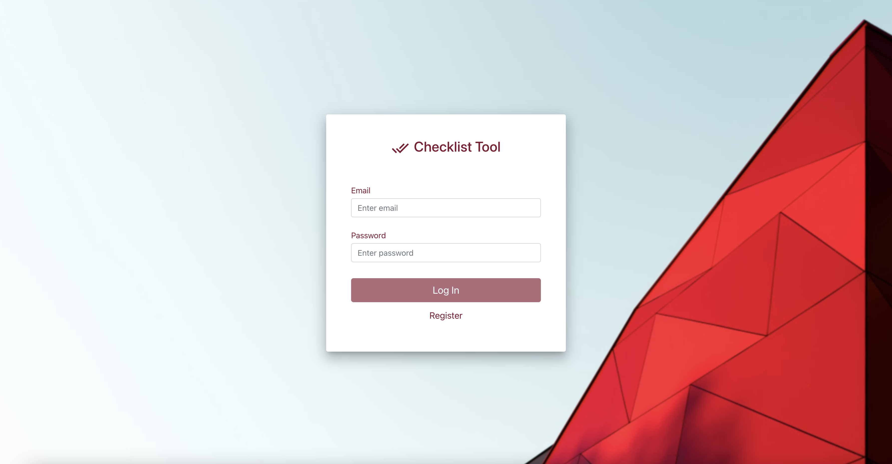
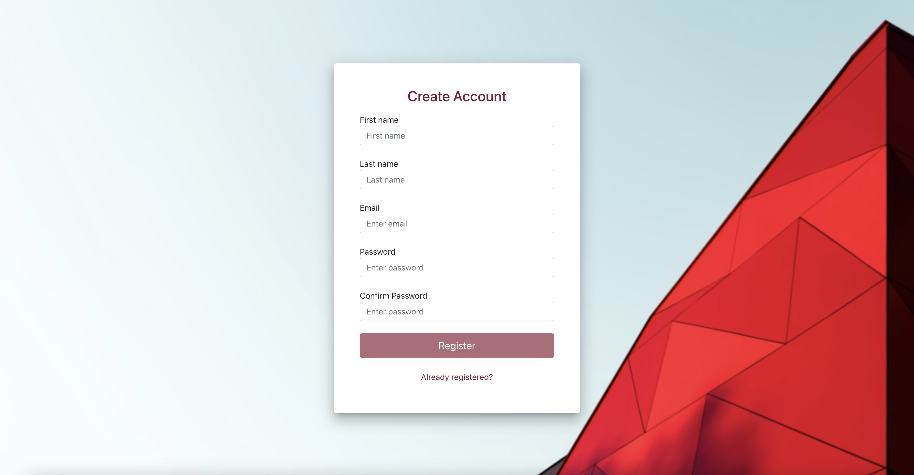
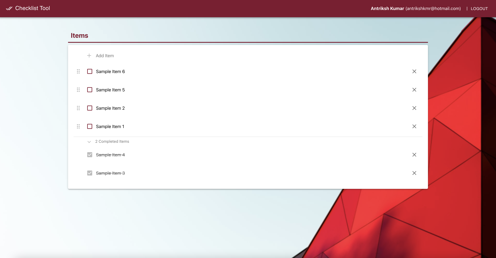

<h2 align="center">
  Sample CheckList WebApp 
</h2>

 

## About the project

Sample checklist webapp to manage your to-do list of items which connects to a Node.js API server. API server code can be found here <a href="https://github.com/antrikshkmr/Checklist-WebApp-Backend-Server" target="_blank">Checklist-WebApp-Backend-Server</a>.  

This project is built using these technologies.

- React.js
- Node.js
- CSS
- Bootstrap

## Features

> **User Login and Registration**

> **JWT based user authentication**

> **User Specific Checklist**

> **Minimalistic UI**

## Screenshots

  
    
      

## Getting Started

Clone this repository. You will need `Node.js` and `Git` installed globally on your machine.

## Installation and Setup Instructions

1.  Create environment variable file(s) with the following variable(s):

    ### **File 1**:

         .env

    #### Variable:

    > REACT_APP_BASE_API_URL = "`YOUR_NODEJS_SERVER_URL`/api"

    ### **File 2** (If you have two different environments):

        .env.development

    #### Variables:

    >REACT_APP_STAGE= "dev" 
    >REACT_APP_BASE_API_URL = "`YOUR_NODEJS_SERVER_URL`/api"

2.  Open the terminal/cmd in the project root directory and run `npm install` command.

3.  Run `npm start` command in your terminal/cmd.

    This would run the app in development mode.
    Open [http://localhost:3000](http://localhost:3000) to view it in the browser.
    The page will reload if you make edits.

    > For running the app in development mode using the environment variables stored in _.env.development_ file you can run `npm start dev` in your terminal/cmd.

## Usage Instructions

Open the project folder and navigate to `/src/`. You will find all the subdirectories with relevant files. 
Each file has inline comments for easy understanding of the code. 

## Sources

- <a href="https://material-ui.com" target="_blank">material-uI</a> : React components for faster and simpler web development.
- <a href="https://www.npmjs.com/package/axios" target="_blank">axios</a> : Promise based HTTP client for the browser and node.js
- <a href="https://www.npmjs.com/package/env-cmd" target="_blank">env-cmd</a> : A simple node program for executing commands using an environment from an env file.
- <a href="https://www.npmjs.com/package/react-beautiful-dnd" target="_blank">react-beautiful-dnd</a> : Beautiful and accessible drag and drop for lists with React.
- <a href="https://www.npmjs.com/package/react-beautiful-dnd" target="_blank">react-beautiful-dnd</a> : Beautiful and accessible drag and drop for lists with React.
- <a href="https://www.npmjs.com/package/jsonwebtoken" target="_blank">jsonwebtoken</a> : An implementation of JSON Web Tokens for React.js and Node.js.
